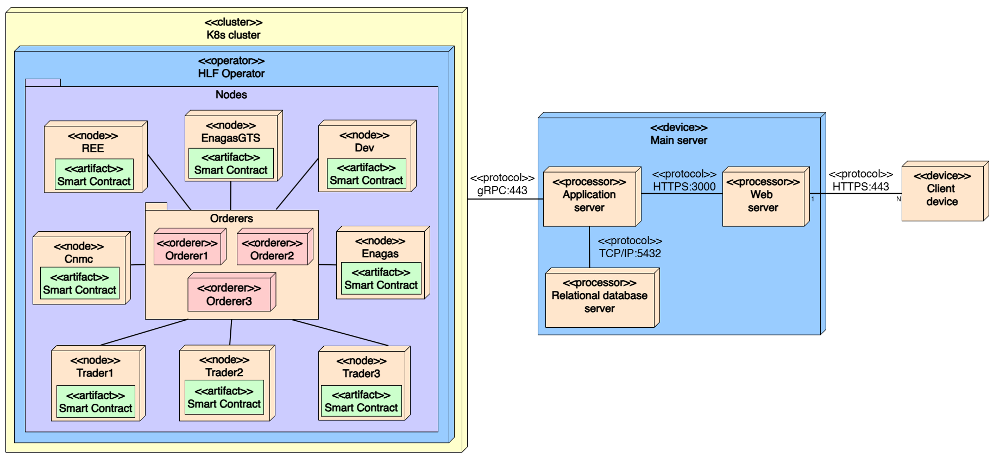

<p align="center">
  
  
  
  
  
  
</p>

# H2GO — Hydrogen Guarantees of Origin

**H2GO** is a full-stack platform for managing **Hydrogen Guarantees of Origin (GOs)** using a permissioned **Hyperledger Fabric** blockchain network. It enables energy market participants (producers, traders, regulators and grid operators) to register hydrogen and electricity production, issue and transfer GOs, and maintain an auditable, tamper-proof record of the entire lifecycle.

## Table of Contents

- [Overview](#overview)
- [Architecture](#architecture)
- [Repository Structure](#repository-structure)
- [Prerequisites](#prerequisites)
- [Quick Start](#quick-start)
- [Documentation Index](#documentation-index)
- [CI/CD](#cicd)
- [License](#license)

## Overview

The Spanish hydrogen market involves multiple stakeholders:

| Role | Organization(s) | MSP ID |
|---|---|---|
| **Grid Operators** | REE (Red Eléctrica de España), Enagás GTS | `ReeMSP`, `EnagasgtsMSP` |
| **Issuing Body** | Enagás | `EnagasMSP` |
| **Regulator** | CNMC | `CnmcMSP` |
| **Traders** | Trader 1, Trader 2, Trader 3 | `Trader1MSP`, `Trader2MSP`, `Trader3MSP` |
| **Development / Admin** | Dev | `DevMSP` |

H2GO provides:

- **Production Registration** — Grid operators register hydrogen and electricity production on the ledger.
- **GO Issuance & Transfer** — Guarantees of Origin are issued, traded, and redeemed.
- **Request Workflow** — Multi-party approval flows enforced by endorsement policies.
- **Auditability** — Every transaction is permanently recorded on the distributed ledger.

## Architecture



## Repository Structure

```
h2go/
├── .github/
│   └── workflows/
│       └── ci.yaml                  # GitHub Actions — runs backend unit tests
│
├── backend/                         # NestJS REST API server
│   ├── src/
│   │   ├── auth/                    # JWT authentication & strategies
│   │   ├── assets/                  # Asset (image) management via Cloudinary
│   │   ├── entities/                # TypeORM entities (User, Organization)
│   │   ├── fabric/                  # Hyperledger Fabric connection manager
│   │   ├── organizations/           # Organization CRUD & blockchain operations
│   │   ├── requests/                # GO request workflows
│   │   └── common/                  # Shared utilities
│   ├── test/                        # Unit & e2e tests
│   ├── Dockerfile
│   └── README.md                    # ⬅ Backend documentation
│
├── frontend/                        # Next.js web application
│   ├── src/
│   │   └── app/
│   │       ├── components/          # Reusable UI components
│   │       ├── context/             # React context providers
│   │       ├── dashboard/           # Dashboard pages (GOs, requests, etc.)
│   │       └── types/               # TypeScript type definitions
│   ├── public/                      # Static assets
│   ├── Dockerfile
│   └── README.md                    # ⬅ Frontend documentation
│
├── h2go-chaincodes/                 # Hyperledger Fabric smart contracts (Go)
│   ├── contracts/
│   │   ├── production_contract.go   # Hydrogen production registration
│   │   ├── request_contract.go      # GO request lifecycle
│   │   └── redemption_contract.go   # GO redemption logic
│   ├── models/                      # Data models & enums
│   ├── main.go                      # Chaincode entrypoint (CaaS mode)
│   └── Dockerfile
│
├── blockchain/                      # Blockchain network infrastructure
│   └── README.md                    # ⬅ Infrastructure setup guide
│
├── postgresql/                      # Standalone PostgreSQL for local dev
│   └── docker-compose.yaml
│
├── docker-compose.yml               # Full-stack local development
├── docker-compose.test.yml          # Test environment configuration
└── README.md                        # ⬅ You are here
```

> **Navigation Tip:** Each major component has its own `README.md` with detailed setup instructions and architecture notes. Click the links below to jump directly.


## Prerequisites

| Tool | Version | Purpose |
|---|---|---|
| [Docker](https://www.docker.com/get-started) | 20+ | Containerization |
| [Docker Compose](https://docs.docker.com/compose/) | v2+ | Multi-container orchestration |
| [Node.js](https://nodejs.org/) | 20 LTS | Backend & Frontend runtime |
| [pnpm](https://pnpm.io/) | 9+ | Package manager |
| [Go](https://golang.org/) | 1.22+ | Chaincode development |
| [Kind](https://kind.sigs.k8s.io/) | Latest (0.31.0) | Local Kubernetes cluster (blockchain infra) |
| [Helm](https://helm.sh/) | 3+ | Kubernetes package manager (blockchain infra) |
| [kubectl](https://kubernetes.io/docs/tasks/tools/) | Latest | Kubernetes CLI (blockchain infra) |


## Quick Start

### Option 1: Docker Compose (Recommended)

> **Note:** The blockchain network must be running first. See the [Blockchain Infrastructure README](./blockchain/README.md) for setup instructions.

```bash
# Clone the repository
git clone https://github.com/AdriianFdz/h2go.git
cd h2go

# Start all services (backend, frontend, PostgreSQL)
docker compose up --build
```

| Service | URL |
|---|---|
| Frontend | http://localhost:3000 |
| Backend API | http://localhost:3003 |
| Swagger Docs | http://localhost:3003/docs |
| PostgreSQL | localhost:5432 |

### Option 2: Local Development

```bash
# 1. Start PostgreSQL
cd postgresql && docker compose up -d && cd ..

# 2. Start the backend
cd backend
pnpm install
pnpm run start:dev

# 3. Start the frontend (in a new terminal)
cd frontend
pnpm install
pnpm dev
```

## Documentation Index

| Document | Description |
|---|---|
| [Backend README](./backend/README.md) | NestJS API — architecture, modules, environment setup, testing |
| [Frontend README](./frontend/README.md) | Next.js app — pages, components, state management |
| [Blockchain Infrastructure README](./blockchain/README.md) | Full guide to deploy the Hyperledger Fabric network on Kubernetes |
| [Chaincode Source](./h2go-chaincodes/) | Smart contract code (Go) — contracts, models |

---

## CI/CD

The project uses **GitHub Actions** for continuous integration:

- **Workflow:** [`.github/workflows/ci.yaml`](./.github/workflows/ci.yaml)
- **Triggers:** Push and pull request on all branches
- **Jobs:**
  - `Unit Tests` — Installs dependencies and runs `pnpm test` in the `backend/` directory


## License

This project is proprietary software. All rights reserved. See [LICENSE](./LICENSE) for details.
