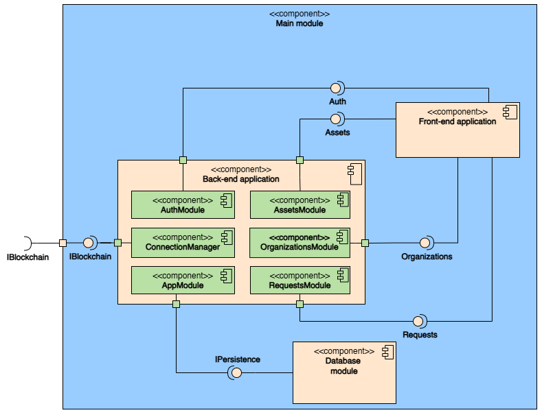

# H2GO — Backend

<p align="center">
  
  
  
  
</p>

The backend is a **NestJS** REST API that bridges the web frontend and the **Hyperledger Fabric** blockchain network. It handles authentication, organization management, and blockchain transaction submissions via the Fabric Gateway SDK.

## Table of Contents

- [Architecture](#architecture)
- [Module Overview](#module-overview)
- [Project Structure](#project-structure)
- [Environment Variables](#environment-variables)
- [Getting Started](#getting-started)
- [API Documentation](#api-documentation)
- [Testing](#testing)
- [Docker](#docker)

## Architecture



## Module Overview

| Module | Path | Description |
|---|---|---|
| **Auth** | `src/auth/` | JWT authentication via Passport.js. Login, registration, HTTP-only cookie tokens. |
| **Organizations** | `src/organizations/` | Org CRUD + blockchain operations: production registration, GO issuance, balance queries. |
| **Requests** | `src/requests/` | Multi-party GO request workflows (transfer, redemption). |
| **Assets** | `src/assets/` | Image management via Cloudinary (upload/retrieval). |
| **Fabric** | `src/fabric/` | Singleton gRPC connection manager for Fabric peers using `@hyperledger/fabric-gateway`. |
| **Entities** | `src/entities/` | TypeORM entities: `User`, `Organization`. |
| **Common** | `src/common/` | Shared guards, decorators, and utilities. |

## Project Structure

```
backend/
├── src/
│   ├── app.module.ts              # Root module
│   ├── main.ts                    # Entrypoint (CORS, Swagger, Cloudinary)
│   ├── auth/                      # Authentication module
│   │   ├── dto/                   # LoginDto, RegisterDto
│   │   ├── interfaces/            # JWT payload
│   │   └── strategies/            # Passport JWT & Local strategies
│   ├── organizations/             # Organization module
│   ├── requests/                  # Request workflow module
│   │   └── dto/
│   ├── assets/                    # Asset upload module
│   │   └── dto/
│   ├── fabric/
│   │   └── connectionManager.ts   # Fabric Gateway connection pool
│   ├── entities/
│   │   ├── user.entity.ts
│   │   └── organization.entity.ts
│   └── common/
├── test/                          # Jest test suites
├── Dockerfile
├── package.json
├── tsconfig.json
└── nest-cli.json
```

## Environment Variables

Create a `.env` file in the `backend/` directory:

```ini
# == Server ==
PORT=3003

# == Hyperledger Fabric Configuration ==
FABRIC_CHANNEL_NAME=main # For Deployments
#FABRIC_CHANNEL_NAME=test # For Tests
FABRIC_CHAINCODE_NAME=h2go-cc
NETWORK_CONFIG_PATH=/app/blockchain/resources/network-config.yaml # Docker Compose
NETWORK_CONFIG_PATH_HOST=/app/blockchain/resources/network-config.yaml # Local

# == JWT Configuration ==
JWT_SECRET=your-jwt-secret
JWT_EXPIRATION=86400000 # 1 day in milliseconds

# == Database Configuration ==
DB_HOST=postgres # Docker Compose
#DB_HOST=localhost # Local
DB_PORT=5432
DB_USERNAME=postgres
DB_PASSWORD=postgres
DB_DATABASE=h2go

# == Paths ==
FABRIC_RESOURCES_PATH=/app/blockchain/resources # Docker Compose
#FABRIC_RESOURCES_PATH=../blockchain/resources # Local


# == Cloudinary ==
CLOUDINARY_CLOUD_NAME=your-cloud-name
CLOUDINARY_API_KEY=your-api-key
CLOUDINARY_API_SECRET=your-api-secret
```

For testing, create `.env.test` with the same structure pointing to a test database and blockchain channel.

## Getting Started

### Docker Compose (from project root)

```bash
docker compose up --build
```

### Local Development

```bash
# Install dependencies
pnpm install

# Start PostgreSQL
cd ../postgresql && docker compose up -d && cd ../backend

# Run in watch mode
pnpm run start:dev
```

### Available Scripts

| Script | Description |
|---|---|
| `pnpm run start` | Start the application |
| `pnpm run start:dev` | Watch mode (auto-reload) |
| `pnpm run start:debug` | Debug mode with inspector |
| `pnpm run start:prod` | Production build |
| `pnpm run build` | Compile TypeScript |
| `pnpm run test` | Run unit tests |
| `pnpm run test:cov` | Coverage report |
| `pnpm run lint` | Lint & auto-fix |
| `pnpm run format` | Prettier formatting |

## API Documentation

Interactive **Swagger UI** available at: **http://localhost:3003/docs**

### Key Endpoints

| Method | Endpoint | Description | Auth |
|---|---|---|---|
| `POST` | `/auth/register` | Register a new user | ❌ |
| `POST` | `/auth/login` | Login (JWT cookie) | ❌ |
| `GET` | `/organizations` | List organizations | ✅ |
| `POST` | `/organizations/production` | Register production | ✅ |
| `GET` | `/organizations/gdos` | Query GOs | ✅ |
| `POST` | `/requests` | Create GO request | ✅ |
| `PATCH` | `/requests/:id` | Update request | ✅ |
| `POST` | `/assets/upload` | Upload image | ✅ |

> Authentication uses JWT tokens in HTTP-only cookies, automatically sent after login.

## Testing

```bash
pnpm run test          # Unit tests
pnpm run test:watch    # Watch mode
pnpm run test:cov      # Coverage report
```

Tests use **Jest** + **ts-jest**. Test files: `test/**/*.spec.ts`.

## Docker

```bash
# Build
docker build -t h2go-backend .

# Run
docker run -p 3003:3003 --env-file .env h2go-backend
```

> The Docker container expects blockchain resources mounted at `/app/blockchain/resources`. See [docker-compose.yml](../docker-compose.yml).

<p align="center">
  <a href="../README.md">⬅ Back to Root</a> · <a href="../frontend/README.md">Frontend ➡</a>
</p>
